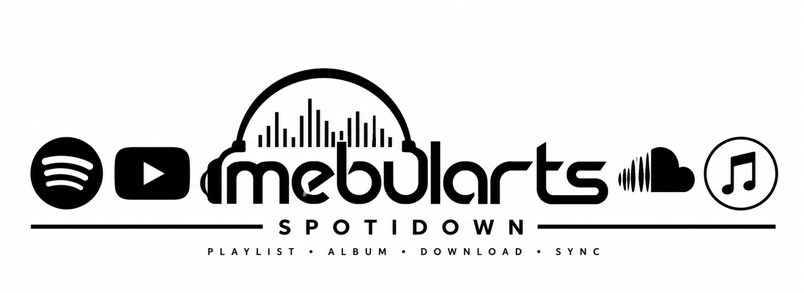

<a id="top"></a>

<div align="center">



# SpotiDown

**Music library sync, deduplication & new-arrivals workflow — by [mebularts](https://github.com/mebularts)**

[](https://www.python.org/)
[](https://www.microsoft.com/windows/)
[](LICENSE)
[](https://github.com/mebularts/spotidown/actions/workflows/ci.yml)
[](https://github.com/mebularts)

**[🇹🇷 Türkçe](#tr) · [🇬🇧 English](#en)**

</div>

---

<a id="tr"></a>

## 🇹🇷 Türkçe

**Bir playlisti tekrar tekrar indirmek yerine, müzik arşivini gerçekten senkronize et.**

## SpotiDown nedir?

SpotiDown, Spotify playlist / albüm / parça metadatasını yerel bir **SQLite müzik arşivi** ile karşılaştıran; daha önce arşivlenmiş parçaları tekrar işlemeyen ve yalnızca gerçekten eksik kayıtları indirme zincirine gönderen bir senkronizasyon aracıdır.

Eski sürümdeki SoundCloud → alternatif SoundCloud sonuçları → Bandcamp → YouTube kurtarma akışı korunurken, üzerine gerçek bir **global arşiv**, **duplicate koruması**, **iki dilli terminal**, **Apple Music yeni gelenler klasörü** ve **legacy import** katmanı eklendi.

> Spotify bu projede metadata, playlist ve keşif kaynağı olarak kullanılır. İçerik sağlayıcılarının kullanım koşullarına ve telif haklarına uymak kullanıcının sorumluluğundadır. Yalnızca indirme/yerel arşivleme hakkına sahip olduğun içeriklerle kullan.

---

## Neden farklı?

Bir playlistte 500 parça olduğunu düşün. Ertesi gün playlistin başına 5 yeni şarkı eklendiğinde klasik sıra numarası mantığı bütün eşlemeyi bozabilir. SpotiDown bunu **Spotify Track ID** ve mümkün olduğunda **ISRC** üzerinden çözer.

```text
Spotify URL
    │
    ▼
Metadata manifesti
    │
    ▼
SQLite global arşiv
    │
    ├── Zaten var ───────────────► atla
    │
    └── Yeni / eksik
            │
            ▼
 SoundCloud → alternatif SC → Bandcamp → YouTube
            │
            ▼
 downloads/library/Artist - Title.mp3
            │
            ├── playlists/*.m3u8
            └── exports/apple-music/<bu turda gelenler>/
```

### Öne çıkanlar

- **Track ID tabanlı dedupe:** Playlist sırası değişse bile eski kayıtlar tekrar işlenmez.
- **ISRC dedupe:** Spotify aynı kaydı farklı track ID ile yayınlasa bile aynı ISRC bulunursa ikinci fiziksel kopya oluşturulmaz.
- **Temiz dosya adı:** Son dosya adı `Sanatçı - Şarkı.mp3`; Spotify ID dosya adında görünmez.
- **Global kütüphane:** Yeni ses dosyaları tek bir `downloads/library/` klasöründe tutulur.
- **Apple Music yeni gelenler:** Her başarılı sync sonunda yalnızca o turda eklenen dosyalar ayrı klasörde görünür.
- **Ek disk alanı yok:** Apple Music klasörü NTFS hardlink kullanır; aynı ses verisi ikinci kez kopyalanmaz.
- **Legacy import:** Eski `1 - Sanatçı - Şarkı.mp3`, `.spotdl` ve `playlist.json` arşivlerini dosyalara dokunmadan tanır.
- **TR / EN terminal:** Dil seçimi ilk açılışta yapılır ve kaydedilir.
- **Tek terminal, çok işlem:** Bir işlem bitince program kapanmaz; ana menüye dönüp başka playlist çalıştırabilirsin.
- **Yeni çıkanlar:** Spotify market koduna göre yeni yayınları tarayabilir (`TR`, `DE`, `US`...).
- **Gizli bilgiler Git'e girmez:** `.env`, cookie, SQLite, ses dosyaları ve çalışma çıktıları `.gitignore` kapsamındadır.

---

## Hızlı başlangıç — Windows

### 1. ZIP'i çıkar

Projeyi istediğin klasöre çıkar. Örneğin:

```text
E:\Spotify\SpotiDown
```

### 2. `SpotiDown.bat` dosyasını aç

İlk açılışta:

```text
Dil / Language
1) Türkçe
2) English
```

seçimi gelir. Sonraki açılışlarda seçimin hatırlanır.

### 3. Eski arşivin varsa önce içe aktar

Menüden:

```text
3) Eski müzik arşivini içe aktar
```

seç ve eski müziklerinin bulunduğu üst klasörü ver. Örneğin:

```text
E:\Spotify\downloads
```

Dosyalar **taşınmaz, silinmez veya yeniden adlandırılmaz**. Sadece SQLite arşivine tanıtılır.

### 4. Playlist senkronize et

```text
1) Playlist / albüm / parça senkronize et
```

ve Spotify URL'ni yapıştır.

SpotiDown önce mevcut arşivle karşılaştırır:

```text
Durum: 184/200 arşivde mevcut, 16 benzersiz parça eksik.
```

Bu örnekte yalnızca 16 eksik kayıt işleme girer.

---

## Terminal menüsü

```text
1) Playlist / albüm / parça senkronize et
2) Yeni çıkanları tara ve senkronize et
3) Eski müzik arşivini içe aktar
4) Arşiv istatistikleri
5) Dil değiştir
6) Çıkış
```

Bir işlem bittiğinde **Enter** ile ana menüye dönersin. Terminal kapanmaz; aynı oturumda başka playlist, import veya istatistik işlemi çalıştırabilirsin.

---

## Dosya isimleri neden artık temiz?

İndirme sırasında güvenilir eşleme için Spotify Track ID yalnızca geçici `.incoming` dosya isminde kullanılır:

```text
downloads/.incoming/<track-id> - Artist - Title.mp3
```

Dosya eşleştirilir eşleştirilmez final kütüphaneye taşınır:

```text
downloads/library/Artist - Title.mp3
```

Aynı isimde gerçekten farklı iki kayıt varsa okunabilir bir sıra eki kullanılır:

```text
Artist - Title.mp3
Artist - Title (2).mp3
```

Track ID final dosya adına eklenmez.

---

## Apple Music'e sadece yeni gelenleri atmak

Her başarılı senkronizasyon sonunda SpotiDown, o çalıştırmada yeni eklenen parçaları burada toplar:

```text
exports/
└── apple-music/
    └── 2026-08-28_03-15-10 - Playlist Adı/
        ├── Sanatçı - Şarkı.mp3
        ├── Sanatçı 2 - Şarkı 2.mp3
        └── ...
```

Bu dosyalar normal kopya değildir. Windows/NTFS üzerinde **hardlink** oluşturulur; yani hem `downloads/library` hem `exports/apple-music/...` altında görünür ama ses verisi diskte bir kez bulunur.

Apple Music'e aktarırken yalnızca son oluşan klasörü seçmen yeterlidir.

Hardlink oluşturulamayan istisnai bir dosya olursa SpotiDown onu kopyalamak yerine `NEW_TRACKS.txt` içine gerçek yolunu yazar; gereksiz disk kullanımı oluşturmaz.

---

## Aynı müzikten neden tek kopya kalıyor?

SpotiDown şu sırayla kontrol eder:

1. **Spotify Track ID** aynı mı?
2. Track ID farklıysa **ISRC** aynı mı?
3. Yerel dosya gerçekten hâlâ mevcut mu?

ISRC aynıysa yeni Spotify kaydı SQLite'a tanıtılır ama mevcut fiziksel ses dosyasına bağlanır.

> Remix, remaster, live, edit gibi gerçekten farklı sürümler farklı ISRC taşıyabilir. Bu durumda ayrı kayıt olarak tutulmaları beklenen davranıştır.

---

## Yeni çıkanlar modu

Menüden:

```text
2) Yeni çıkanları tara ve senkronize et
```

seçebilirsin. Varsayılan market `TR`'dir; istersen `DE`, `US`, `GB` gibi bir market kodu girebilirsin.

Bu mod için Spotify Web API uygulamana ait Client ID ve Client Secret gerekir.

`.env.example` dosyasını `.env` olarak kopyala:

```env
SPOTIFY_CLIENT_ID=your_client_id
SPOTIFY_CLIENT_SECRET=your_client_secret
SPOTIDOWN_PROXY=
```

`.env` dosyası Git tarafından takip edilmez.

Komut satırından:

```powershell
py -3 spotidown.py discover --market TR
```

Daha geniş tarama:

```powershell
py -3 spotidown.py discover --market TR --days 14 --pages 8 --max-tracks 250
```

`market=TR`, sanatçının Türk olduğu anlamına gelmez; kaydın Spotify Türkiye kataloğunda kullanılabilir olduğu anlamına gelir.

---

## Komut satırı kullanımı

### Playlist / albüm / parça

```powershell
py -3 spotidown.py sync "https://open.spotify.com/playlist/PLAYLIST_ID"
```

Kısa kullanım da desteklenir:

```powershell
py -3 spotidown.py "https://open.spotify.com/playlist/PLAYLIST_ID"
```

### Eski arşivi tanıt

```powershell
py -3 spotidown.py import-legacy "E:\Spotify\downloads"
```

### İstatistik

```powershell
py -3 spotidown.py stats
```

### Kurtarma aşaması sayısı

```powershell
py -3 spotidown.py sync "SPOTIFY_URL" --passes 2
```

`--passes` değerleri:

| Değer | Akış |
|---:|---|
| `1` | SoundCloud |
| `2` | + alternatif SoundCloud yüklemeleri |
| `3` | + Bandcamp |
| `4` | + YouTube / YouTube Music |

---

## Proje yapısı

```text
SpotiDown/
├── SpotiDown.bat
├── spotidown.py
├── requirements.txt
├── .env.example
├── .gitignore
├── LICENSE
├── README.md
├── assets/
│   └── spotidown-banner.png
├── Publish-GitHub.ps1
├── Publish-GitHub.bat
├── spotidown_core/
│   ├── engine.py
│   ├── library.py
│   ├── discover.py
│   └── i18n.py
├── data/
│   └── manifests/
├── downloads/
│   ├── .incoming/
│   └── library/
├── exports/
│   └── apple-music/
└── playlists/
```

---

## Güvenlik

Repo içine şunları koyma:

- Spotify Client Secret
- Proxy kullanıcı adı / şifresi
- YouTube cookie dosyaları
- Kişisel `.env`
- `library.sqlite`

Bunların tamamı varsayılan `.gitignore` içinde korunur.

Eski projeden gelen bir secret daha önce herhangi bir yerde yayınlandıysa yalnızca dosyadan silmek yeterli değildir; ilgili anahtarı/şifreyi servis tarafında yenilemek gerekir.

---

## GitHub'a tek komutla yayınlama

Projede hazır gelen script:

```powershell
powershell -ExecutionPolicy Bypass -File .\Publish-GitHub.ps1
```

Şunları otomatik yapar:

- Git ve GitHub CLI kontrolü
- Gerekirse GitHub CLI kurulumu
- GitHub oturum açma akışı
- `main` branch hazırlığı
- güvenli dosyaların commit edilmesi
- `mebularts/spotidown` public reposunun oluşturulması
- `origin` ayarı ve push
- repository topic'lerinin eklenmesi
- `v2.0.0` GitHub Release oluşturulması ve temiz release ZIP'inin yüklenmesi

İstersen `Publish-GitHub.bat` dosyasına çift tıklayarak da aynı scripti çalıştırabilirsin. Script ilk kez oluşturulan boş Git reposunu, mevcut `origin` durumunu ve daha önce oluşturulmuş release durumunu güvenli biçimde algılar; beklenen “henüz yok” kontrolleri PowerShell hatası olarak işlemi durdurmaz.

---

## Kullanılan bileşenler

SpotiDown kendi arşiv/senkron katmanını sağlar ve çalışma sırasında aşağıdaki açık kaynak araçlarla entegre olur:

- [spotDL](https://github.com/spotDL/spotify-downloader)
- [yt-dlp](https://github.com/yt-dlp/yt-dlp)
- FFmpeg
- Deno
- SQLite

Bu projelerin kendi lisansları ve kullanım şartları geçerlidir.

---

## Lisans

SpotiDown'ın bu repodaki özgün kodu [MIT License](LICENSE) ile yayınlanır.

[↑ Başa dön](#top)

---

<a id="en"></a>

## 🇬🇧 English

**Sync your music library instead of processing the same playlist over and over.**

## What is SpotiDown?

SpotiDown compares Spotify playlist / album / track metadata against a **global SQLite music library**, skips tracks that are already present, and sends only genuinely missing entries into the source recovery pipeline.

It keeps the SoundCloud → alternative SoundCloud uploads → Bandcamp → YouTube flow from the older project, then adds a proper **global archive**, **duplicate protection**, **bilingual terminal UI**, **Apple Music new-arrivals batches**, and **legacy archive migration**.

> Spotify is used as a metadata, playlist and discovery source. You are responsible for complying with the terms and copyright rules of every service and content source involved. Use the project only with content you are authorized to download or archive locally.

---

## Why is it different?

Imagine a 500-track playlist. Five new tracks are inserted at the top tomorrow. A position-based archive can suddenly treat the whole playlist incorrectly. SpotiDown uses **Spotify Track IDs** and, when available, **ISRC** instead.

```text
Spotify URL
    │
    ▼
Metadata manifest
    │
    ▼
Global SQLite library
    │
    ├── Already present ─────────► skip
    │
    └── New / missing
            │
            ▼
 SoundCloud → alternative SC → Bandcamp → YouTube
            │
            ▼
 downloads/library/Artist - Title.mp3
            │
            ├── playlists/*.m3u8
            └── exports/apple-music/<new in this run>/
```

### Highlights

- **Track-ID deduplication:** Reordering a playlist does not trigger duplicate work.
- **ISRC deduplication:** If Spotify exposes the same recording under another track ID, an identical ISRC reuses the existing physical audio file.
- **Clean filenames:** Final files are named `Artist - Title.mp3`; Spotify IDs are not exposed in final filenames.
- **Global library:** New audio is stored once under `downloads/library/`.
- **Apple Music new-arrivals folders:** Every successful sync creates a batch containing only tracks added in that run.
- **No duplicate disk usage:** New-arrivals batches use NTFS hardlinks instead of copying audio bytes.
- **Legacy import:** Existing `.spotdl`, `playlist.json`, and `1 - Artist - Title.mp3` archives can be indexed without moving them.
- **TR / EN terminal:** Language is selected once and remembered.
- **Multiple operations per terminal session:** A completed task returns to the menu instead of closing the program.
- **New-release discovery:** Scan by Spotify market code such as `TR`, `DE`, or `US`.
- **Secret-safe repo defaults:** `.env`, cookies, SQLite databases, audio and runtime output are ignored by Git.

---

## Quick start — Windows

### 1. Extract the ZIP

For example:

```text
E:\Spotify\SpotiDown
```

### 2. Launch `SpotiDown.bat`

The first launch asks for a language:

```text
Dil / Language
1) Türkçe
2) English
```

The choice is stored for future sessions.

### 3. Import an existing archive first

Choose:

```text
3) Import legacy music archive
```

and point SpotiDown to the parent folder containing your old files, for example:

```text
E:\Spotify\downloads
```

Files are **not moved, deleted or renamed**. Their locations are only registered in SQLite.

### 4. Sync a Spotify URL

Choose:

```text
1) Sync playlist / album / track
```

and paste your URL.

SpotiDown first checks the existing library:

```text
Status: 184/200 already in library, 16 unique tracks missing.
```

Only the 16 missing entries are processed.

---

## Terminal menu

```text
1) Sync playlist / album / track
2) Discover and sync new releases
3) Import legacy music archive
4) Library statistics
5) Change language
6) Exit
```

When a task finishes, press **Enter** to return to the main menu. You can immediately run another playlist, import or statistics operation in the same terminal.

---

## Clean final filenames

Track IDs are used only in the temporary `.incoming` stage to make post-download identification reliable:

```text
downloads/.incoming/<track-id> - Artist - Title.mp3
```

The file is then moved to the final library as:

```text
downloads/library/Artist - Title.mp3
```

If two genuinely different tracks collide on the same readable name, a clean numeric suffix is used:

```text
Artist - Title.mp3
Artist - Title (2).mp3
```

No Spotify ID is added to the final filename.

---

## Import only newly added tracks into Apple Music

After each successful sync, tracks downloaded during that run are exposed under:

```text
exports/
└── apple-music/
    └── 2026-08-28_03-15-10 - Playlist Name/
        ├── Artist - Track.mp3
        ├── Artist 2 - Track 2.mp3
        └── ...
```

These are **NTFS hardlinks**, not second copies. The same audio bytes remain stored once while the files appear in both the global library and the new-arrivals batch.

To import into Apple Music, drag only the latest batch folder.

If a hardlink cannot be created, SpotiDown does not silently copy the audio. It writes the original paths into `NEW_TRACKS.txt` instead.

---

## Duplicate strategy

SpotiDown checks:

1. **Spotify Track ID**
2. If the Track ID differs, **ISRC**
3. Whether the registered local file still exists

If the ISRC matches an already downloaded recording, the new Spotify entry points at the existing physical file.

> Remixes, remasters, live versions and edits can have different ISRCs. Those are intentionally treated as separate recordings.

---

## New Releases mode

Choose:

```text
2) Discover and sync new releases
```

The default market is `TR`, but you can enter `DE`, `US`, `GB`, or another Spotify market code.

This mode requires your own Spotify Web API Client ID and Client Secret. Copy `.env.example` to `.env`:

```env
SPOTIFY_CLIENT_ID=your_client_id
SPOTIFY_CLIENT_SECRET=your_client_secret
SPOTIDOWN_PROXY=
```

`.env` is ignored by Git.

CLI example:

```powershell
py -3 spotidown.py discover --market TR
```

Wider scan:

```powershell
py -3 spotidown.py discover --market TR --days 14 --pages 8 --max-tracks 250
```

`market=TR` means the recording is available in Spotify's Türkiye market; it does not imply the artist is Turkish.

---

## CLI usage

### Playlist / album / track

```powershell
py -3 spotidown.py sync "https://open.spotify.com/playlist/PLAYLIST_ID"
```

Short form:

```powershell
py -3 spotidown.py "https://open.spotify.com/playlist/PLAYLIST_ID"
```

### Import a legacy archive

```powershell
py -3 spotidown.py import-legacy "E:\Spotify\downloads"
```

### Statistics

```powershell
py -3 spotidown.py stats
```

### Recovery depth

```powershell
py -3 spotidown.py sync "SPOTIFY_URL" --passes 2
```

| Value | Pipeline |
|---:|---|
| `1` | SoundCloud |
| `2` | + alternative SoundCloud uploads |
| `3` | + Bandcamp |
| `4` | + YouTube / YouTube Music |

---

## Project layout

```text
SpotiDown/
├── SpotiDown.bat
├── spotidown.py
├── requirements.txt
├── .env.example
├── .gitignore
├── LICENSE
├── README.md
├── assets/
│   └── spotidown-banner.png
├── Publish-GitHub.ps1
├── Publish-GitHub.bat
├── spotidown_core/
│   ├── engine.py
│   ├── library.py
│   ├── discover.py
│   └── i18n.py
├── data/
│   └── manifests/
├── downloads/
│   ├── .incoming/
│   └── library/
├── exports/
│   └── apple-music/
└── playlists/
```

---

## Security

Never commit:

- Spotify Client Secrets
- Proxy credentials
- YouTube cookies
- Personal `.env` files
- `library.sqlite`

The default `.gitignore` protects all of them.

If a secret from an older project was ever published elsewhere, removing it from a file is not sufficient; rotate the credential at the provider as well.

---

## Publish to GitHub with one command

Run the included script:

```powershell
powershell -ExecutionPolicy Bypass -File .\Publish-GitHub.ps1
```

It handles:

- Git and GitHub CLI checks
- GitHub CLI installation when needed
- GitHub authentication
- `main` branch setup
- safe file commit
- creation of the public `mebularts/spotidown` repository
- `origin` setup and push
- repository topics
- a `v2.0.0` GitHub Release with a clean release ZIP

You can also double-click `Publish-GitHub.bat`. The publisher safely detects a brand-new empty Git repository, the current `origin` state, and whether the release already exists; expected “not created yet” checks do not abort PowerShell.

---

## Components

SpotiDown provides the archive/sync layer and integrates with these open-source tools at runtime:

- [spotDL](https://github.com/spotDL/spotify-downloader)
- [yt-dlp](https://github.com/yt-dlp/yt-dlp)
- FFmpeg
- Deno
- SQLite

Their own licenses and terms apply.

---

## License

Original SpotiDown code in this repository is released under the [MIT License](LICENSE).

[↑ Back to top](#top)

---

<div align="center">

**Built by [mebularts](https://github.com/mebularts)**  
[mebularts.com.tr](https://mebularts.com.tr)

`sync smarter • store once • keep it clean`

</div>
